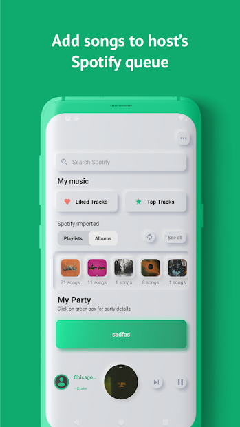
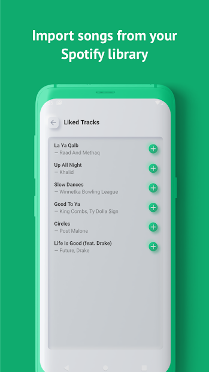
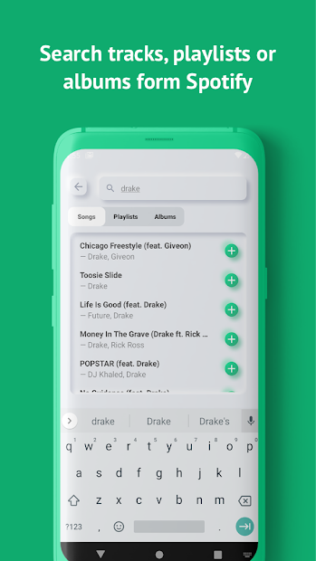

[![MIT License][license-shield]][license-url]
[![LinkedIn][linkedin-shield]][linkedin-url]

<!-- INTRO. -->
 

  <h3 align="center">AirTune</h3>

  

A Spotify Jukebox Full-Stack Android Application  
     
    
      
    <a href="https://github.com/hammamziadeh10/AirTune/issues">Report Bug</a>
    ·
    <a href="https://github.com/hammamziadeh10/AirTune/issues">Request Feature</a>
  

<!-- TABLE OF CONTENTS -->
## Table of Contents

* [Details](#details)
* [Contact](#contact)

<!-- DESIGN -->
## Details

* An Android Mobile Application that allows Spotify users to add and listen to music together on one queue. 
* Built using Java, Kotlin & XML through Android Studio. Applied JUnit for testing.
* Utilized Spotify’s RESTful API for authentication and retrieval of data. Made use of Spotify’s Remote SDK to add to the queue and play music.
* Developed a Realtime communication channel with Firebase Realtime database (NoSQL) to allow instant communication between the host and everyone within the host’s party. Implemented several Firebase cloud functions using NodeJS to instill server-side functionalities such as deleting an inactive party.

 

<!-- CONTACT -->
## Contact

Hammam Ziadeh - hammamziadeh10@gmail.com

Project Link: [https://github.com/hammamziadeh10/AirTune](https://github.com/hammamziadeh10/AirTune)

[license-shield]: https://img.shields.io/github/license/othneildrew/Best-README-Template.svg?style=flat-square
[license-url]: https://github.com/othneildrew/Best-README-Template/blob/master/LICENSE.txt
[linkedin-shield]: https://img.shields.io/badge/-LinkedIn-black.svg?style=flat-square&logo=linkedin&colorB=555
[linkedin-url]: https://www.linkedin.com/in/hammam-ziadeh/
